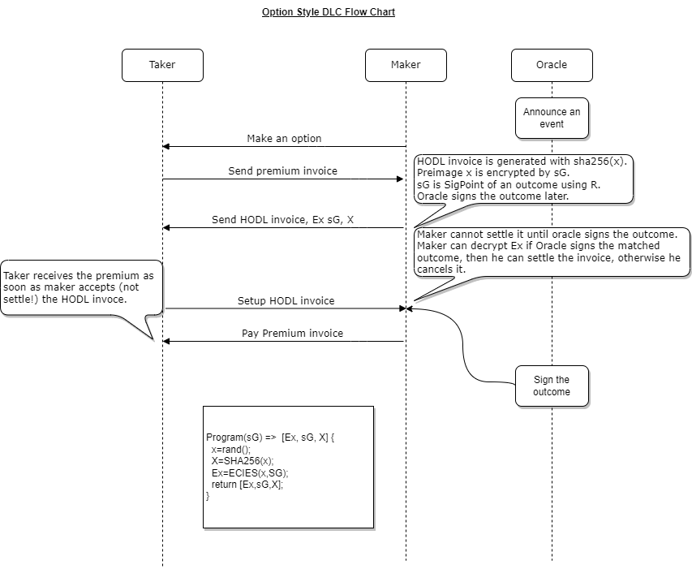

# DLC-LN
DLC-LN is a server to provide option style DLC.



### Install
```
git clone {this repo}
cd dlc-ln
npm install
```
### Configure

```
cp .env.example .env
```

```
npx prisma migrate reset
npx prisma migrate dev --name init
prisma migrate dev --name added_job_title
```


### Run
```
npm start
```

### Example
```
curl -s -X GET http://localhost:4000/events
```

```
curl -s -X POST http://localhost:3000/dlc \
-H "Content-Type: application/json" \
-d '{"eventName":"BTC_price_will_be_up_at_2022-03-03T19:48:06.676Z", "m":"Yes", "R":"a6508bad0c370091fd4c928b894016a9ec709ce78c3868b1e5b1e1f963269659", "P": "ac83a93b89c1b0a1e3ca1cec06f17a7876cf502f9bd5614dfaae8f038d57826b", "invoice": "lntb1u1p3zzxcnpp5ck8l4hdyqa96xddncqnkgmz0rj2cjqxuxmfgd6vhxdf9gful3uqsdqqcqzpgxqyz5vqsp53uhn2va9gh6fh3xxrt6r4ykxm9vyxywxsfraf024vkuwladju2kq9qyyssqmg3wxnmjcrhgz6z9cznpnf0gcspkv0mtwgg8vvkjjazy8tee8678ex8tdsfxap2yta5fk5pv0ww0uy0w66v0vl57hc2pw8q7ne33pmgqn45pck"}'
```

```
curl -s -X PUT http://localhost:3000/dlc \
-H "Content-Type: application/json" \
-d '{"Ex":"addcb2a5912e51a423919ab3e7bc24c20410a821bb44ddef2a682c393dcde3f99412d40cfa3d11f359d3f400b1f3e16cfba8dd8434200d4ea207d50a6b2542cf0a610326563e229d27148c6f91f00d4f903345c714a54ae57e3cb64819ac416cce72918e0f2751e647d2acdc53e4455804185bbed45acd0630257727df591f2b8651bdc7f354e456396eaf298f8d88edbfdd6078acbb8e658486bae4e9a234ff9a", "s":"26f3c853eeb03e7a89ad2da3d86de1822372b01cda607d18295b40a94267f7b733d7acd0c3d7bbbb39f438d26abdd04084e73c359da159144c5bac79e20b5626"}'
```